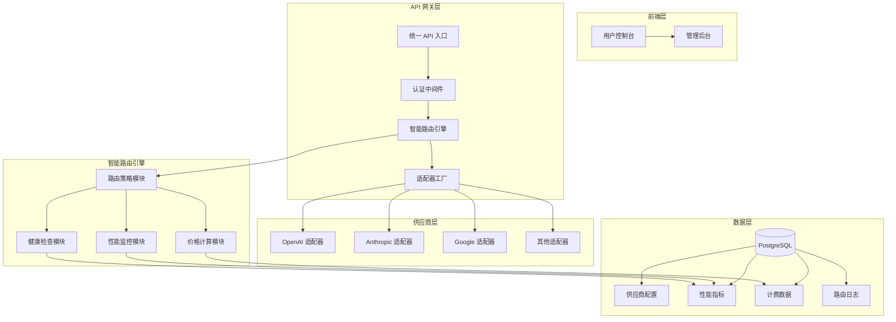
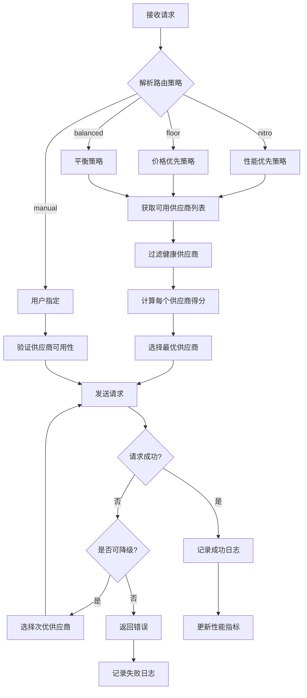

# LMRouter 改造方案

## 📋 项目概述

本方案旨在将 LMRouter 从基础的 API 路由服务升级为具备**智能路由引擎**和**后端管理平台**的企业级 AI API 网关。

### 改造目标

1. **后端管理平台** - 实现供应商入驻与接入的可视化管理
2. **智能路由引擎** - 实现动态路由与自动采购决策
3. **性能监控系统** - 实时监控供应商运行状况和性能指标
4. **完善前端 UI** - 补全计费、管理等缺失功能

---

## 🏗️ 系统架构设计

### 整体架构图



---

## 📊 数据库扩展设计

### 新增数据表

#### 1. 供应商管理表 (providers)

```sql
CREATE TABLE providers (
  id TEXT PRIMARY KEY DEFAULT gen_random_uuid(),
  name TEXT NOT NULL UNIQUE,
  display_name TEXT NOT NULL,
  type TEXT NOT NULL, -- 'openai', 'anthropic', 'google', 'fireworks'
  base_url TEXT NOT NULL,
  api_key_encrypted TEXT NOT NULL,
  icon TEXT,
  description TEXT,
  website TEXT,
  status TEXT DEFAULT 'active', -- 'active', 'inactive', 'maintenance'
  priority INTEGER DEFAULT 0,
  weight INTEGER DEFAULT 100,
  max_rpm INTEGER, -- 每分钟最大请求数
  max_tpm INTEGER, -- 每分钟最大 Token 数
  created_at TIMESTAMP DEFAULT NOW(),
  updated_at TIMESTAMP DEFAULT NOW()
);
```

#### 2. 模型配置表 (models)

```sql
CREATE TABLE models (
  id TEXT PRIMARY KEY DEFAULT gen_random_uuid(),
  name TEXT NOT NULL UNIQUE,
  display_name TEXT,
  type TEXT NOT NULL, -- 'language', 'image', 'embedding', 'audio'
  icon TEXT,
  author TEXT,
  description TEXT,
  context_window INTEGER,
  max_tokens INTEGER,
  created_at TIMESTAMP DEFAULT NOW(),
  updated_at TIMESTAMP DEFAULT NOW()
);
```

#### 3. 模型-供应商关联表 (model_providers)

```sql
CREATE TABLE model_providers (
  id TEXT PRIMARY KEY DEFAULT gen_random_uuid(),
  model_id TEXT NOT NULL REFERENCES models(id),
  provider_id TEXT NOT NULL REFERENCES providers(id),
  provider_model_name TEXT NOT NULL,
  max_tokens INTEGER,
  pricing_input DECIMAL(21, 9),
  pricing_output DECIMAL(21, 9),
  pricing_image DECIMAL(21, 9),
  pricing_audio DECIMAL(21, 9),
  is_enabled BOOLEAN DEFAULT true,
  priority INTEGER DEFAULT 0,
  created_at TIMESTAMP DEFAULT NOW(),
  updated_at TIMESTAMP DEFAULT NOW(),
  UNIQUE(model_id, provider_id)
);
```

#### 4. 性能指标表 (performance_metrics)

```sql
CREATE TABLE performance_metrics (
  id TEXT PRIMARY KEY DEFAULT gen_random_uuid(),
  provider_id TEXT NOT NULL REFERENCES providers(id),
  model_id TEXT REFERENCES models(id),
  metric_type TEXT NOT NULL, -- 'ttft', 'throughput', 'latency', 'uptime'
  value DECIMAL(21, 9) NOT NULL,
  timestamp TIMESTAMP DEFAULT NOW(),
  metadata JSONB
);

-- 创建索引以支持快速查询
CREATE INDEX idx_metrics_provider_timestamp ON performance_metrics(provider_id, timestamp);
CREATE INDEX idx_metrics_model_timestamp ON performance_metrics(model_id, timestamp);
```

#### 5. 路由决策日志表 (routing_logs)

```sql
CREATE TABLE routing_logs (
  id TEXT PRIMARY KEY DEFAULT gen_random_uuid(),
  request_id TEXT NOT NULL,
  model_name TEXT NOT NULL,
  strategy TEXT NOT NULL, -- 'nitro', 'floor', 'balanced', 'manual'
  selected_provider TEXT NOT NULL,
  alternatives JSONB, -- 备选提供商列表
  decision_reason TEXT,
  ttft_ms INTEGER,
  total_latency_ms INTEGER,
  input_tokens INTEGER,
  output_tokens INTEGER,
  cost DECIMAL(21, 9),
  status TEXT, -- 'success', 'failed', 'fallback'
  error_message TEXT,
  created_at TIMESTAMP DEFAULT NOW()
);

CREATE INDEX idx_routing_logs_timestamp ON routing_logs(created_at);
CREATE INDEX idx_routing_logs_provider ON routing_logs(selected_provider, created_at);
```

#### 6. 供应商健康状态表 (provider_health)

```sql
CREATE TABLE provider_health (
  id TEXT PRIMARY KEY DEFAULT gen_random_uuid(),
  provider_id TEXT NOT NULL REFERENCES providers(id),
  status TEXT NOT NULL, -- 'healthy', 'degraded', 'down'
  uptime_percentage DECIMAL(5, 2),
  avg_ttft_ms INTEGER,
  avg_throughput_tps DECIMAL(10, 2),
  error_rate DECIMAL(5, 2),
  last_check_at TIMESTAMP DEFAULT NOW(),
  check_interval_seconds INTEGER DEFAULT 60,
  created_at TIMESTAMP DEFAULT NOW(),
  updated_at TIMESTAMP DEFAULT NOW()
);
```

---

## 🧠 智能路由引擎设计

### 核心模块

#### 1. 路由策略模块 (RoutingStrategy)

```typescript
// src/engine/strategies/base.ts
export interface RoutingStrategy {
  name: string;
  selectProvider(
    model: LMRouterConfigModel,
    providers: ProviderWithMetrics[],
    context: RequestContext
  ): ProviderSelection;
}

// 路由策略类型
export type StrategyType = 
  | 'nitro'      // 追求速度：选择 TTFT 最低的供应商
  | 'floor'      // 追求低价：选择价格最低的供应商
  | 'balanced'   // 平衡模式：综合考虑价格和性能
  | 'round-robin' // 轮询：均匀分配请求
  | 'sticky'     // 粘性：同一用户使用同一供应商
  | 'manual';    // 手动：用户指定供应商
```

#### 2. 性能监控模块 (PerformanceMonitor)

```typescript
// src/engine/monitoring/performance.ts
export class PerformanceMonitor {
  // 记录请求性能指标
  async recordMetric(
    providerId: string,
    metricType: MetricType,
    value: number,
    metadata?: Record<string, any>
  ): Promise<void>;
  
  // 获取供应商性能统计
  async getProviderStats(
    providerId: string,
    timeRange: TimeRange
  ): Promise<ProviderStats>;
  
  // 获取实时 TTFT
  async getRealtimeTTFT(providerId: string): Promise<number>;
  
  // 获取吞吐量
  async getThroughput(providerId: string): Promise<number>;
}
```

#### 3. 健康检查模块 (HealthChecker)

```typescript
// src/engine/monitoring/health.ts
export class HealthChecker {
  // 定期检查供应商健康状态
  async checkProviderHealth(providerId: string): Promise<HealthStatus>;
  
  // 获取供应商可用性
  async getProviderUptime(providerId: string): Promise<number>;
  
  // 标记供应商为不可用
  async markProviderDown(providerId: string, reason: string): Promise<void>;
  
  // 恢复供应商
  async markProviderUp(providerId: string): Promise<void>;
}
```

#### 4. 价格计算模块 (PriceCalculator)

```typescript
// src/engine/pricing/calculator.ts
export class PriceCalculator {
  // 计算请求成本
  calculateRequestCost(
    providerId: string,
    modelId: string,
    usage: UsageMetrics
  ): Decimal;
  
  // 获取最低价格供应商
  getCheapestProvider(
    modelId: string,
    estimatedTokens: number
  ): ProviderWithPrice;
  
  // 获取性价比最优供应商
  getBestValueProvider(
    modelId: string,
    weights: ValueWeights // { price: 0.4, speed: 0.4, reliability: 0.2 }
  ): ProviderWithScore;
}
```

### 路由决策流程



### 路由策略实现示例

#### Nitro 策略（速度优先）

```typescript
// src/engine/strategies/nitro.ts
export class NitroStrategy implements RoutingStrategy {
  name = 'nitro';
  
  async selectProvider(
    model: LMRouterConfigModel,
    providers: ProviderWithMetrics[],
    context: RequestContext
  ): Promise<ProviderSelection> {
    // 1. 过滤健康的供应商
    const healthyProviders = providers.filter(p => p.healthStatus === 'healthy');
    
    // 2. 获取每个供应商的实时 TTFT
    const providersWithTTFT = await Promise.all(
      healthyProviders.map(async (p) => ({
        ...p,
        realtimeTTFT: await this.performanceMonitor.getRealtimeTTFT(p.id)
      }))
    );
    
    // 3. 按 TTFT 排序，选择最快的
    const sorted = providersWithTTFT.sort((a, b) => 
      a.realtimeTTFT - b.realtimeTTFT
    );
    
    return {
      provider: sorted[0],
      reason: `Selected for lowest TTFT: ${sorted[0].realtimeTTFT}ms`,
      alternatives: sorted.slice(1, 3)
    };
  }
}
```

#### Floor 策略（价格优先）

```typescript
// src/engine/strategies/floor.ts
export class FloorStrategy implements RoutingStrategy {
  name = 'floor';
  
  async selectProvider(
    model: LMRouterConfigModel,
    providers: ProviderWithMetrics[],
    context: RequestContext
  ): Promise<ProviderSelection> {
    // 1. 过滤健康的供应商
    const healthyProviders = providers.filter(p => p.healthStatus === 'healthy');
    
    // 2. 估算请求的 Token 数
    const estimatedTokens = this.estimateTokens(context.messages);
    
    // 3. 计算每个供应商的成本
    const providersWithCost = healthyProviders.map(p => ({
      ...p,
      estimatedCost: this.priceCalculator.calculateRequestCost(
        p.id,
        model.id,
        { input: estimatedTokens.input, output: estimatedTokens.output }
      )
    }));
    
    // 4. 按成本排序，选择最便宜的
    const sorted = providersWithCost.sort((a, b) => 
      a.estimatedCost.comparedTo(b.estimatedCost)
    );
    
    return {
      provider: sorted[0],
      reason: `Selected for lowest cost: $${sorted[0].estimatedCost.toFixed(6)}`,
      alternatives: sorted.slice(1, 3)
    };
  }
}
```

#### Balanced 策略（平衡模式）

```typescript
// src/engine/strategies/balanced.ts
export class BalancedStrategy implements RoutingStrategy {
  name = 'balanced';
  
  // 默认权重配置
  private defaultWeights = {
    price: 0.4,      // 价格权重 40%
    speed: 0.4,      // 速度权重 40%
    reliability: 0.2  // 可靠性权重 20%
  };
  
  async selectProvider(
    model: LMRouterConfigModel,
    providers: ProviderWithMetrics[],
    context: RequestContext
  ): Promise<ProviderSelection> {
    const healthyProviders = providers.filter(p => p.healthStatus === 'healthy');
    
    // 计算每个供应商的综合得分
    const providersWithScore = await Promise.all(
      healthyProviders.map(async (p) => {
        const priceScore = await this.calculatePriceScore(p, model);
        const speedScore = await this.calculateSpeedScore(p);
        const reliabilityScore = await this.calculateReliabilityScore(p);
        
        const totalScore = 
          priceScore * this.defaultWeights.price +
          speedScore * this.defaultWeights.speed +
          reliabilityScore * this.defaultWeights.reliability;
        
        return { ...p, totalScore, priceScore, speedScore, reliabilityScore };
      })
    );
    
    // 选择得分最高的
    const sorted = providersWithScore.sort((a, b) => b.totalScore - a.totalScore);
    
    return {
      provider: sorted[0],
      reason: `Selected for best balance (score: ${sorted[0].totalScore.toFixed(2)})`,
      alternatives: sorted.slice(1, 3),
      scores: {
        price: sorted[0].priceScore,
        speed: sorted[0].speedScore,
        reliability: sorted[0].reliabilityScore
      }
    };
  }
  
  private async calculatePriceScore(
    provider: ProviderWithMetrics,
    model: LMRouterConfigModel
  ): Promise<number> {
    // 价格越低，得分越高（0-100）
    const cost = this.priceCalculator.calculateRequestCost(provider.id, model.id, {
      input: 1000,
      output: 1000
    });
    const maxCost = new Decimal(0.1); // 假设最高成本 $0.1
    return Math.max(0, 100 - cost.div(maxCost).mul(100).toNumber());
  }
  
  private async calculateSpeedScore(provider: ProviderWithMetrics): Promise<number> {
    // TTFT 越低，得分越高（0-100）
    const ttft = await this.performanceMonitor.getRealtimeTTFT(provider.id);
    const maxTTFT = 5000; // 假设最高延迟 5000ms
    return Math.max(0, 100 - (ttft / maxTTFT) * 100);
  }
  
  private async calculateReliabilityScore(provider: ProviderWithMetrics): Promise<number> {
    // 可用性越高，得分越高（0-100）
    const uptime = await this.healthChecker.getProviderUptime(provider.id);
    return uptime; // 可用性本身就是百分比
  }
}
```

---

## 🎛️ 后端管理平台设计

### API 接口设计

#### 1. 供应商管理 API

```typescript
// src/routes/admin/providers.ts

// 获取所有供应商
GET /admin/providers
Response: {
  providers: Provider[]
}

// 获取单个供应商详情
GET /admin/providers/:id
Response: {
  provider: Provider,
  metrics: ProviderMetrics,
  health: HealthStatus
}

// 创建供应商
POST /admin/providers
Body: {
  name: string,
  display_name: string,
  type: 'openai' | 'anthropic' | 'google' | 'fireworks',
  base_url: string,
  api_key: string,
  icon?: string,
  description?: string,
  website?: string,
  max_rpm?: number,
  max_tpm?: number
}

// 更新供应商
PUT /admin/providers/:id
Body: Partial<Provider>

// 删除供应商
DELETE /admin/providers/:id

// 测试供应商连接
POST /admin/providers/:id/test
Response: {
  success: boolean,
  latency_ms: number,
  error?: string
}

// 启用/禁用供应商
PATCH /admin/providers/:id/status
Body: {
  status: 'active' | 'inactive' | 'maintenance'
}
```

#### 2. 模型管理 API

```typescript
// src/routes/admin/models.ts

// 获取所有模型
GET /admin/models
Response: {
  models: Model[]
}

// 创建模型
POST /admin/models
Body: {
  name: string,
  display_name?: string,
  type: 'language' | 'image' | 'embedding' | 'audio',
  context_window?: number,
  max_tokens?: number
}

// 为模型添加供应商
POST /admin/models/:id/providers
Body: {
  provider_id: string,
  provider_model_name: string,
  max_tokens?: number,
  pricing?: PricingConfig
}

// 更新模型-供应商配置
PUT /admin/models/:id/providers/:providerId
Body: Partial<ModelProvider>

// 从模型移除供应商
DELETE /admin/models/:id/providers/:providerId
```

#### 3. 性能监控 API

```typescript
// src/routes/admin/metrics.ts

// 获取供应商性能指标
GET /admin/providers/:id/metrics
Query: {
  metric_type?: 'ttft' | 'throughput' | 'latency' | 'uptime',
  start_time?: string,
  end_time?: string,
  interval?: '1m' | '5m' | '1h' | '1d'
}
Response: {
  metrics: MetricDataPoint[]
}

// 获取所有供应商性能对比
GET /admin/metrics/compare
Query: {
  model_id: string,
  time_range: '1h' | '24h' | '7d'
}
Response: {
  comparison: ProviderComparison[]
}

// 获取实时健康状态
GET /admin/health
Response: {
  providers: ProviderHealthStatus[]
}
```

#### 4. 路由日志 API

```typescript
// src/routes/admin/routing-logs.ts

// 获取路由日志
GET /admin/routing-logs
Query: {
  start_time?: string,
  end_time?: string,
  provider?: string,
  strategy?: string,
  status?: 'success' | 'failed' | 'fallback',
  limit?: number,
  offset?: number
}
Response: {
  logs: RoutingLog[],
  total: number
}

// 获取路由统计
GET /admin/routing-logs/stats
Query: {
  time_range: '1h' | '24h' | '7d' | '30d',
  group_by?: 'provider' | 'strategy' | 'model'
}
Response: {
  stats: RoutingStats[]
}
```

---

## 🖥️ 前端管理界面设计

### 新增页面

#### 1. 管理后台首页 (AdminDashboard)

```
┌─────────────────────────────────────────────────────────┐
│  LMRouter 管理后台                                       │
├─────────────────────────────────────────────────────────┤
│  ┌─────────┐  ┌─────────┐  ┌─────────┐  ┌─────────┐    │
│  │ 总请求数 │  │ 总费用  │  │ 平均TTFT│  │ 成功率  │    │
│  │  12,345  │  │ $123.45 │  │  234ms  │  │ 99.5%   │    │
│  └─────────┘  └─────────┘  └─────────┘  └─────────┘    │
│                                                         │
│  ┌─────────────────────┐  ┌─────────────────────┐       │
│  │  供应商状态          │  │  路由策略分布        │       │
│  │  ✅ OpenAI    99.9% │  │  nitro:    45%      │       │
│  │  ✅ Anthropic 99.5% │  │  floor:    30%      │       │
│  │  ⚠️  Google   98.2% │  │  balanced: 25%      │       │
│  │  ❌ Fireworks 95.0% │  │                      │       │
│  └─────────────────────┘  └─────────────────────┘       │
└─────────────────────────────────────────────────────────┘
```

#### 2. 供应商管理页面 (ProvidersPage)

```
┌─────────────────────────────────────────────────────────┐
│  供应商管理                              [+ 添加供应商]  │
├─────────────────────────────────────────────────────────┤
│  ┌─────────────────────────────────────────────────┐   │
│  │ 名称      │ 类型      │ 状态    │ TTFT   │ 操作 │   │
│  ├─────────────────────────────────────────────────┤   │
│  │ OpenAI    │ openai    │ ✅ 正常 │ 120ms  │ 编辑 │   │
│  │ Anthropic │ anthropic │ ✅ 正常 │ 180ms  │ 编辑 │   │
│  │ Google    │ google    │ ⚠️ 降级 │ 350ms  │ 编辑 │   │
│  │ Fireworks │ fireworks │ ❌ 停机 │   -    │ 编辑 │   │
│  └─────────────────────────────────────────────────┘   │
│                                                         │
│  [测试连接]  [查看指标]  [编辑]  [禁用]  [删除]         │
└─────────────────────────────────────────────────────────┘
```

#### 3. 模型管理页面 (ModelsPage)

```
┌─────────────────────────────────────────────────────────┐
│  模型管理                                  [+ 添加模型]  │
├─────────────────────────────────────────────────────────┤
│  ┌─────────────────────────────────────────────────┐   │
│  │ 模型名称        │ 类型     │ 供应商数 │ 操作    │   │
│  ├─────────────────────────────────────────────────┤   │
│  │ gpt-4-turbo    │ language │ 2       │ 管理    │   │
│  │ claude-3-opus  │ language │ 1       │ 管理    │   │
│  │ dall-e-3       │ image    │ 1       │ 管理    │   │
│  └─────────────────────────────────────────────────┘   │
│                                                         │
│  点击"管理"展开详情：                                   │
│  ┌─────────────────────────────────────────────────┐   │
│  │ 供应商    │ 模型名称          │ 价格      │ 状态 │   │
│  ├─────────────────────────────────────────────────┤   │
│  │ OpenAI   │ gpt-4-turbo-preview│ $0.01/1K │ ✅   │   │
│  │ Azure    │ gpt-4              │ $0.03/1K │ ✅   │   │
│  └─────────────────────────────────────────────────┘   │
└─────────────────────────────────────────────────────────┘
```

#### 4. 性能监控页面 (MetricsPage)

```
┌─────────────────────────────────────────────────────────┐
│  性能监控                                               │
├─────────────────────────────────────────────────────────┤
│  时间范围: [1小时] [24小时] [7天] [30天]                │
│                                                         │
│  ┌─────────────────────────────────────────────────┐   │
│  │  TTFT 对比 (ms)                                 │   │
│  │  500│                                            │   │
│  │     │    ╭─── OpenAI                             │   │
│  │  400│    │                                        │   │
│  │     │    │    ╭─── Anthropic                      │   │
│  │  300│    │    │                                   │   │
│  │     │────┴────┴─── Google                         │   │
│  │  200│                                             │   │
│  │     └────────────────────────────────────────    │   │
│  └─────────────────────────────────────────────────┘   │
│                                                         │
│  ┌─────────────────────────────────────────────────┐   │
│  │  吞吐量对比 (tokens/sec)                         │   │
│  │  ...                                            │   │
│  └─────────────────────────────────────────────────┘   │
└─────────────────────────────────────────────────────────┘
```

#### 5. 路由日志页面 (RoutingLogsPage)

```
┌─────────────────────────────────────────────────────────┐
│  路由日志                                               │
├─────────────────────────────────────────────────────────┤
│  筛选: [策略 ▼] [供应商 ▼] [状态 ▼] [时间范围 ▼]       │
│                                                         │
│  ┌─────────────────────────────────────────────────┐   │
│  │ 时间      │ 模型        │ 策略    │ 供应商    │ 状态│   │
│  ├─────────────────────────────────────────────────┤   │
│  │ 12:34:56 │ gpt-4       │ nitro   │ OpenAI   │ ✅  │   │
│  │ 12:34:55 │ claude-3    │ floor   │ Anthropic│ ✅  │   │
│  │ 12:34:54 │ gpt-4       │ nitro   │ Azure    │ ❌  │   │
│  │ 12:34:54 │ gpt-4       │ nitro   │ OpenAI   │ ✅  │ ←降级│
│  └─────────────────────────────────────────────────┘   │
│                                                         │
│  点击查看详情：                                         │
│  ┌─────────────────────────────────────────────────┐   │
│  │ 请求 ID: req_abc123                             │   │
│  │ 策略: nitro (追求速度)                          │   │
│  │ 选择原因: TTFT 最低 (120ms)                     │   │
│  │ 备选供应商: Azure (150ms), Google (350ms)       │   │
│  │ 实际 TTFT: 125ms                                │   │
│  │ 总延迟: 1,234ms                                 │   │
│  │ Token: 1,234 输入 + 567 输出                    │   │
│  │ 费用: $0.0123                                   │   │
│  └─────────────────────────────────────────────────┘   │
└─────────────────────────────────────────────────────────┘
```

---

## 📅 分阶段实施计划

### 第一阶段：基础设施（2-3 周）

**目标：** 建立数据库模型和基础 API

**任务：**
1. ✅ 创建新的数据库表（providers, models, model_providers, performance_metrics, routing_logs, provider_health）
2. ✅ 实现供应商管理 CRUD API
3. ✅ 实现模型管理 CRUD API
4. ✅ 实现基础的性能指标记录 API
5. ✅ 添加数据库迁移脚本

**交付物：**
- 数据库迁移文件
- 供应商管理 API
- 模型管理 API
- API 文档

---

### 第二阶段：智能路由引擎（3-4 周）

**目标：** 实现核心路由逻辑

**任务：**
1. ✅ 实现路由策略接口和基础类
2. ✅ 实现 Nitro 策略（速度优先）
3. ✅ 实现 Floor 策略（价格优先）
4. ✅ 实现 Balanced 策略（平衡模式）
5. ✅ 实现性能监控模块
6. ✅ 实现健康检查模块
7. ✅ 实现价格计算模块
8. ✅ 集成路由引擎到现有请求流程
9. ✅ 实现故障转移和降级逻辑

**交付物：**
- 智能路由引擎核心模块
- 三种路由策略实现
- 性能监控系统
- 健康检查系统

---

### 第三阶段：管理后台前端（3-4 周）

**目标：** 实现可视化管理界面

**任务：**
1. ✅ 创建管理后台布局和导航
2. ✅ 实现管理后台首页（Dashboard）
3. ✅ 实现供应商管理页面
4. ✅ 实现模型管理页面
5. ✅ 实现性能监控页面
6. ✅ 实现路由日志页面
7. ✅ 实现管理员认证和权限控制
8. ✅ 对接后端 API

**交付物：**
- 管理后台前端应用
- 5 个核心管理页面
- 管理员认证系统

---

### 第四阶段：完善用户端功能（2-3 周）

**目标：** 补全现有用户端缺失功能

**任务：**
1. ✅ 完善 StatsPage，对接真实计费 API
2. ✅ 实现余额显示和充值功能
3. ✅ 实现费用明细页面
4. ✅ 实现路由策略选择 UI（:nitro, :floor 等）
5. ✅ 实现用户端路由日志查看
6. ✅ 优化整体 UI/UX

**交付物：**
- 完善的用户控制台
- 计费和充值功能
- 路由策略选择界面

---

### 第五阶段：测试和优化（2 周）

**目标：** 确保系统稳定性和性能

**任务：**
1. ✅ 单元测试覆盖核心模块
2. ✅ 集成测试路由引擎
3. ✅ 性能测试和优化
4. ✅ 安全审计
5. ✅ 文档完善
6. ✅ 部署指南更新

**交付物：**
- 测试报告
- 性能优化报告
- 完整文档

---

## 🎯 技术选型建议

### 后端

| 组件 | 当前 | 建议 | 理由 |
|------|------|------|------|
| 框架 | Hono | 保持 | 轻量、高性能 |
| 数据库 | PostgreSQL | 保持 | 成熟、可靠 |
| ORM | Drizzle | 保持 | 类型安全、轻量 |
| 缓存 | 无 | Redis | 性能指标缓存 |
| 队列 | 无 | Bull/BullMQ | 异步任务处理 |

### 前端

| 组件 | 当前 | 建议 | 理由 |
|------|------|------|------|
| 框架 | React | 保持 | 生态成熟 |
| 构建 | Vite | 保持 | 快速 |
| 样式 | Tailwind | 保持 | 实用优先 |
| 图表 | Recharts | 保持 | 简单易用 |
| 状态 | 无 | Zustand | 轻量状态管理 |
| 请求 | Axios | 保持 | 成熟稳定 |

---

## 📊 预期效果

### 功能对比

| 功能 | 改造前 | 改造后 |
|------|--------|--------|
| 供应商管理 | 配置文件 | 可视化管理平台 |
| 模型配置 | 配置文件 | 可视化管理平台 |
| 路由策略 | 顺序遍历 | 智能路由引擎 |
| 性能监控 | 无 | 实时监控系统 |
| 健康检查 | 无 | 自动健康检查 |
| 故障转移 | 手动 | 自动降级 |
| 路由日志 | 无 | 完整日志系统 |
| 计费 UI | 模拟数据 | 真实数据对接 |
| 管理后台 | 无 | 完整管理平台 |

### 性能指标

- **TTFT 优化**：通过智能路由，平均 TTFT 预计降低 30-50%
- **成本优化**：通过价格优先策略，成本预计降低 20-40%
- **可用性提升**：通过自动故障转移，可用性预计提升至 99.9%+

---

## 🔐 安全考虑

1. **API 密钥加密存储** - 使用 AES-256 加密存储供应商 API 密钥
2. **管理员认证** - 实现基于角色的访问控制（RBAC）
3. **审计日志** - 记录所有管理操作
4. **速率限制** - 防止 API 滥用
5. **数据备份** - 定期备份配置和日志数据

---

## 📝 总结

本改造方案将 LMRouter 从基础的 API 路由服务升级为具备以下能力的企业级 AI API 网关：

1. **可视化管理** - 通过管理后台轻松管理供应商和模型
2. **智能路由** - 根据策略自动选择最优供应商
3. **实时监控** - 全面监控供应商性能和健康状态
4. **自动优化** - 持续优化路由决策，降低成本、提升性能
5. **完善计费** - 真实的计费数据和充值功能

**预计总工期：12-16 周**

**建议优先级：**
1. 第一阶段（基础设施）- 必须
2. 第二阶段（智能路由引擎）- 必须
3. 第三阶段（管理后台）- 推荐
4. 第四阶段（用户端完善）- 推荐
5. 第五阶段（测试优化）- 必须
